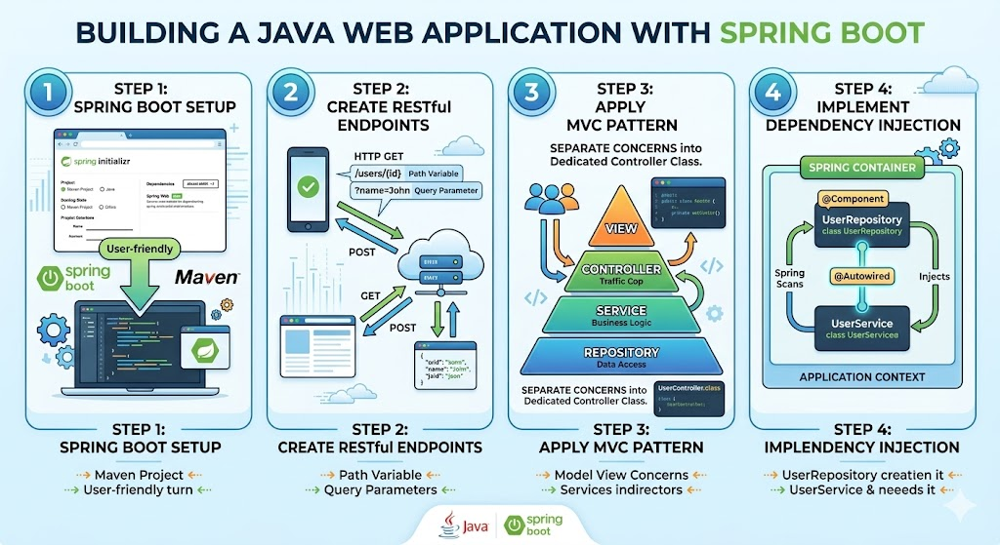

# [3.11] Web Application Development with RESTful APIs

## Lesson Overview

## Dependencies

- [Self Studies](./studies.md) / [Lesson](./lesson.md) / [Assignment](./assignment.md) / [Slide Deck](./slides.md)

## Lesson Objectives

By the end of this lesson, students will be able to:

* **Set up** and run a Spring Boot project using Spring Initializr and Maven
* **Create** RESTful endpoints with query parameters and path variables following REST design guidelines
* **Apply** the MVC pattern by separating concerns into a dedicated Controller class
* **Implement** Dependency Injection using `@Component` and `@Autowired`

## Lesson Plan

| Duration | What | How or Why |
|---|---|---|
| 10 min | Warm-up | Recap HTTP methods (GET, POST, PUT, DELETE) and JSON — students likely have prior exposure; this primes them for REST design |
| 10 min | Part 1: API-Centric Approach | Conceptual overview — establish why frontend and backend are separated and how the API bridges them |
| 15 min | Parts 2 & 3: REST API + Design Guidelines | Cover REST definition, key constraints, and practical design rules (nouns, status codes, versioning, stateless) |
| 30 min | Part 4: What is Spring Boot | Project setup via Spring Initializr, project structure walkthrough, running the app, adding `spring-boot-starter-web` and DevTools |
| 20 min | Part 5: Basic Routing | Code-along — `@GetMapping`, `@RequestParam`, `@PathVariable`; test endpoints via browser, Postman, or Thunder Client |
| 10 min | Activity 1 — Products endpoints | Students create 3 endpoints independently: `/products/`, `/products/{id}`, `/products?search=` |
| 10 min | Break | — |
| 15 min | Part 6: MVC + Controller separation | Introduce MVC pattern; move routes out of main class into `SampleController.java` with `@RestController` |
| 15 min | Part 7: `application.properties` + Logging | Configure port and app name via `@Value`; add SLF4J logging (builds on Lesson 3.9 SLF4J knowledge) |
| 15 min | Part 8: Dependency Injection | Introduce `@Component` and `@Autowired`; return a `SampleItem` object from an endpoint |
| 15 min | Activity 2 — simple-crm project | Students create a new Spring Boot project with a `Customer` POJO, inject it, and expose a `/customer` endpoint |
| 15 min | Wrap-up | Recap REST design rules, MVC separation, and DI; preview how the next lesson builds on this foundation |
| **180 min** | **Total** | |