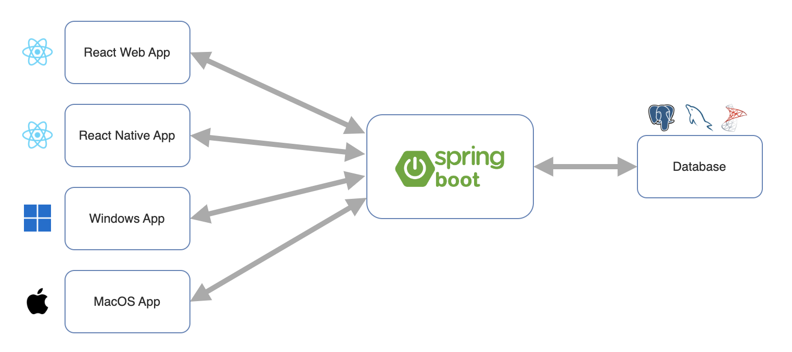

# Lesson: Web Application Development with RESTful APIs

## Lesson Overview
This lesson introduces students to modern web application development using RESTful APIs. Students will learn the fundamental principles of REST architecture, API design best practices, and how to build backend services that can be consumed by multiple client applications (web, mobile, desktop). Using Spring Boot as the implementation framework, students will understand the API-centric approach where frontend and backend are developed separately and communicate via HTTP. The lesson covers project setup, routing, request handling, dependency injection, and the Model-View-Controller (MVC) architectural pattern. By the end of this lesson, students will be able to build a functional RESTful API backend that follows industry best practices and can serve as the foundation for full-stack applications.

---

## Lesson Objectives
By the end of this lesson, students will be able to:
- Understand API-centric architecture and apply REST principles and design guidelines
- Set up and configure a Spring Boot project using Spring Initializr and Maven
- Create RESTful endpoints with query parameters and path variables
- Implement the Model-View-Controller (MVC) pattern by separating concerns
- Apply Dependency Injection principles using Spring annotations

---

## Part 1: API-Centric Approach

In a modern application, we usually separate our frontend and backend. The frontend is a web application that is built using React, Vue, Angular, etc.

The backend is usually a server that is built using a framework such as Spring Boot, NodeJS/Express, etc.

The frontend and backend communicate with each other via an API.

This is known as an API-centric approach. The frontend (user interface) and backend (data and logic) are developed separately and the API is the primary means of communication between them.

Spring Boot Backend API can be consumed by:

- ReactJS Frontend
- ReactNative Frontend
- Native Windows App
- Native MacOS App



The API can be consumed by other applications such as mobile apps, desktop apps, etc, thus allowing us to reuse the backend code while catering to different platforms and devices.

---

## Part 2: REST API

We have been using the term **API** loosely to refer to a REST API e.g. loading data using GET request, creating data using POST request, updating data using PUT request, deleting data using DELETE request, etc.

As a matter of fact, the term API emerged long before REST APIs were invented, sometime in the 1960s.

API stands for **A**pplication **P**rogramming **I**nterface. It defines how two software components should interact with each other.

There are many types of APIs such as

- Library APIs,
- Operating System APIs,
- Hardware APIs,
- Web APIs,
- and more

When we write a Java class with public methods, we are creating a Library/Class API for other Java classes to use.

A **REST API** (also known as RESTful API) is a web API that conforms to the constraints of the REST architectural style. REST stands for representational state transfer and was created by computer scientist Roy Fielding to guide the design and development of the architecture for the World Wide Web.

REST architectural style is based on the following 6 constraints:

1. Client-server architecture

- separation UI concerns from data. Client and server can be developed independently.

2. Stateless

- Each request from client to server must contain all of the information necessary to understand the request, and cannot take advantage of any stored context on the server. This simplifies the server components because no session information needs to be stored between requests.

3. Cacheable

- Responses can be marked as cacheable or not cacheable. If a response is cacheable, then a client cache is given the right to reuse that response data for later, equivalent requests.

4. Uniform interface

- a uniform way to manipulate resources (data) through their representations

5. Layered system

- proxy servers, load balancers, etc can be added to improve scalability

6. Code on demand (optional)

- Servers can temporarily extend or customize the functionality of a client by transferring executable code.

---

## Part 3: REST API Design Guidelines

### Define Endpoints using Nouns

APIs are about accessing resources. A resource is basically just information or data e.g. users, expenses, products, etc. We specify `HTTP` methods to access the resources e.g. `GET`, `POST`, `PUT`, `DELETE`, etc.

In our backend, we will define endpoints that will allow us to access the resources e.g.
```
www.example.com/api/users
www.example.com/api/expenses
www.example.com/api/products
```

We should use plural **nouns** instead of verbs in the endpoints. The HTTP methods (verbs) will be used to specify the actions to be performed on the resources.
```
GET www.example.com/api/users // ✅ Get all users
POST www.example.com/api/users // ✅ Create a new user
PUT www.example.com/api/users // ✅ Update a user
DELETE www.example.com/api/users // ✅ Delete all users
```

Do not use verbs in the endpoints.
```
GET www.example.com/api/getUsers ❌
POST www.example.com/api/addUser ❌
PUT www.example.com/api/updateUser ❌
DELETE www.example.com/api/deleteUser ❌
```

### Use JSON for data exchange

The recommended data exchange format for REST APIs is JSON. JSON stands for JavaScript Object Notation. It is a lightweight data-interchange format that is easy for humans to read and for machines to parse and generate.

### Stateless

Stateless means that the server does not store any state about the client session on the server side. The client is responsible for sending its state to the server. For example, if the client needs to browse page 5 of a list of users, the client will send this information to the server and the server will return the list of users starting from page 5.
```
GET www.example.com/api/users?page=5
```

The server does not store any information about the client session. If the client wants to access page 6, it will have to send the page number to the server again.

### Versioning

APIs are usually versioned to allow for backward compatibility. If we make improvements to the API, we can create a new version of the API. At the same time, the older version can still be maintained to support existing clients.
```
www.example.com/api/v1/users
www.example.com/api/v2/users
```

### HTTP Status Codes

HTTP status codes are used to indicate the status of the request. For example, if the request is successful, the server will generally return a status code of `200`. If the request is not successful, the server will return a status code of `400` or `500`.

We should return the appropriate status code for each request.

The list of HTTP status codes can be found [here](https://developer.mozilla.org/en-US/docs/Web/HTTP/Status).

---

## Part 4: What is Spring Boot

Java Spring Boot is a framework that allows us to build web applications quickly and easily. It is built on top of the Spring framework and provides a simpler and faster way to set up, configure, and startup web-based applications.

### Opinionated vs Non-opinionated Framework

Java Spring Boot is an **opinionated** framework. This means that it provides a set of predefined conventions, best practices, and structures that developers are expected to follow. This allows us to focus on building the application and reduces the number of decisions to make.

This is in contrast to a **unopinionated** library such as React, where we have to make a lot of decisions on how to structure the application. Developers have to decide on the folder structure, the libraries to use, etc. It does not enforce any conventions or best practices. As a result , the codebases of non-opinionated libraries tend to be more diverse and inconsistent.

### Inversion of Control (IoC) and Dependency Injection (DI)

Spring Boot uses the **Inversion of Control (IoC)** principle to manage the dependencies of the application. Inversion of Control means that the control of the application is inverted.

In traditional programming, our code directly controls the creation and management of objects. e.g. :
```java
public class MyApplication {
  public static void main(String[] args) {
    // Create a new object
    MyObject myObject = new MyObject();
    // Call a method on the object
    myObject.doSomething();
  }
}
```

With IoC, instead of the application controlling the objects, the objects are controlled by the framework.

Spring Boot achieves this by using Dependency Injection (DI). This is done by injecting the dependencies i.e., the objects that a class depends on, into the class. This is in contrast to the class creating the dependencies itself as in the example above.

We will see this in action later.

### Creation of Spring Project via Initializr

Note: We will be using Spring Boot 3.3.5

First, let's install the [Spring Boot Extension Pack](https://marketplace.visualstudio.com/items?itemName=vmware.vscode-boot-dev-pack) in VS Code. Restart VS Code after installation.

We can create a new Spring Boot Project using Spring Initializr. This can be done using the Spring Boot Extension Pack or by going to [Spring Initializr](https://start.spring.io/).

1. Open your Command Palette (Ctrl/Cmd + Shift + P) and type in "Spring Initializr" and select "Create a Maven Project".
1. Choose version `3.3.5`.
1. Choose Java as language.
1. The `groupId` identifies your organization. Usually we use the reverse domain name of your organization e.g. `sg.edu.ntu`.
1. The `artifactId` is the name of your application. The convention is use lowercase and hyphenate multiple words e.g. `spring-demo`.
1. For packaging type, choose `jar`.
1. For Java version, choose `21`.

We do not need any dependencies for now.

Select the folder to save the project, and open the project in VS Code.

### Structure of a Spring Boot Project

A Spring Boot project is a Maven project. Maven is a build automation tool used primarily for Java projects. It is used to manage the dependencies of the project and to build the project.

The structure of a Spring Boot project is as follows:
```
spring-demo
├── src
│   ├── main
│   │   ├── java
│   │   │   └── com
│   │   │       └── example
│   │   │           └── myspringbootproject
│   │   │               └── MySpringbootProjectApplication.java
│   │   └── resources
│   │       └── application.properties
│   └── test
│       └── java
│           └── com
│               └── example
│                   └── myspringbootproject
│                       └── MySpringbootProjectApplicationTests.java
├── target
├── mvnw
├── mvnw.cmd
├── pom.xml
└── README.md
```

- `src` : source code of the application.
- `main` : functional code of the application.
- `test` : test code.
- `target` : compiled code. This folder is created when we compile the code.
- `resources` : resources such as images, etc.
- `application.properties` file : configuration properties for the application.
- `pom.xml` file : the configuration for Maven.
- `mvnw` and `mvnw.cmd` files: Maven wrappers
- `README.md` file : documentation for the project.

### Running the Spring Boot Application

Every application has an entry point. For Spring Boot, the entry point is the `main` method in the `MySpringbootProjectApplication.java` file (or whatever name you have given to the project).
```
src/main/java/com/example/myspringbootproject/MySpringbootProjectApplication.java
```

Notice that the initial code is annotated with `@SpringBootApplication`. This instruments the class to be the entry point for the Spring Boot application.
```java
@SpringBootApplication
public class DemoSpringBootApplication {

    public static void main(String[] args) {
        SpringApplication.run(DemoSpringBootApplication.class, args);
    }

}
```

We can run the Spring Boot application using the `mvn` command in the terminal. If you look at the project folder, you will also see a `mvnw` file. This is a Maven wrapper that allows us to run Maven commands without having to install Maven on our computer. Both commands will work.

To run the Spring Boot app:
```bash
mvn spring-boot:run
```

You can also use the Maven wrapper:
```bash
# For Bash (WSL)
./mvnw spring-boot:run
# For PowerShell
.\mvnw spring-boot:run
# For Windows Command Prompt
mvnw spring-boot:run
```

This compiles the code and runs the application.

We can specify the `clean` option to clean the target folder before compiling the code. This is useful if you have made changes to the code and want to recompile the code from scratch. Sometimes, this fixes some random issues with running the application.
```bash
mvn clean spring-boot:run
```

### Dependencies

Dependencies are external libraries that our application depends on. For example, if we want to use the Spring Web library, we need to add the dependency to our project.

We can search for dependencies in [Maven Central](https://mvnrepository.com/).

Dependencies are specified in the `pom.xml` file. The `pom.xml` file is the Maven Project Object Model (POM) file. It is an XML file that contains information about the project and configuration details used by Maven to build the project.

Let's install our first dependency, the **[Spring Boot Starter Web](https://mvnrepository.com/artifact/org.springframework.boot/spring-boot-starter-web)** library. If you copied the XML from Maven Central, just omit the `<version>` tag, so that it will follow the version specified in the `<parent>` tag.
```xml
  <dependency>
    <groupId>org.springframework.boot</groupId>
    <artifactId>spring-boot-starter-web</artifactId>
  </dependency>
```

> Sidenote: you can install an [extension](https://marketplace.visualstudio.com/items?itemName=redhat.vscode-xml) for XML formatting in VS Code. This will help you to format the XML nicely.

The `groupId` identifies the group of the dependency while the `artifactId` identifies the artifact (library) of the dependency.

The `spring-boot-starter-web` dependency is a starter dependency that includes all the dependencies required to build a web application.

By adding this dependency, we are embedding the Tomcat web server into our application.

Try starting the app now.

Open your browser and access the app at `localhost:8080`. You will see a Whitelabel Error Page, which means that it is working correctly. This is because we have not defined any routes yet.

We can add a placeholder page by adding an `index.html` file in the `resources/static` folder.

To change the port number, we can specify the port number in the `application.properties` file. The default port number is `8080`.
```
# Server Configuration
server.port=8081
```

You will need to restart the app for the changes to take effect.

### Central vs Local Maven Repository

Maven downloads the dependencies from a central repository. The central repository is located at [https://repo.maven.apache.org/maven2/](https://repo.maven.apache.org/maven2/). This is the default repository that Maven uses.

If you are using Maven for the first time, it will take some time to download the dependencies from the central repository. Subsequent downloads will be faster as the dependencies are cached locally.

When you run your application, Maven looks for the dependencies in the local repository first. If it cannot find the dependencies, it will download the dependencies from the central repository.

You can check out your local Maven repository at `C:\Users\<username>\.m2\repository` (Windows) or `~/.m2/repository` (Mac/Linux).

### Adding a Second Dependency

Let's add a second dependency, the **[Spring Boot DevTools](https://mvnrepository.com/artifact/org.springframework.boot/spring-boot-devtools)** library. This library provides additional development-time features such as automatic restart of the application when we update and save our code.
```xml
<dependency>
  <groupId>org.springframework.boot</groupId>
  <artifactId>spring-boot-devtools</artifactId>
</dependency>
```

Try changing the code or the server port. You will notice that the application will restart automatically.

---

## Part 5: Basic Routing

A route means the path to a resource. For example, the route to the homepage is `/` and the route to the about page is `/about`.

In our application class file, annotate it with `@RestController` to tell Spring Boot that this is a controller class that handles web requests.
```java
@SpringBootApplication
@RestController
public class DemoSpringBootApplication {

    public static void main(String[] args) {
        SpringApplication.run(DemoSpringBootApplication.class, args);
    }

}
```

When you annotate a class with `@RestController`, it becomes the entry point for all web requests. This means that any object you return from this class will be serialized i.e., converted to JSON and returned to the client.

Under the hood, Spring Boot uses the Jackson library to convert the object to JSON for us.

### Basic Mapping

Let's add our first route. The route we want to define is `/hello`.

We will use the `@GetMapping` annotation to specify the route. The `@GetMapping` annotation is a shortcut for `@RequestMapping(method = RequestMethod.GET)`. This annotation tells Spring Boot that this method will handle GET requests to the `/hello` route.
```java
@GetMapping("/hello")
public String hello() {
  return "Hello World!";
}
```

### Accessing Endpoints

There are few ways to access the endpoints.

1. Open your browser and access the route at `localhost:8080/hello`.
1. Use Postman and send a GET request to `localhost:8080/hello`.
1. Use Thunder Client in VS Code to send a GET request to `localhost:8080/hello`.
1. Use YARC in Chrome to send a GET request to `localhost:8080/hello`.
1. Use the `curl` command in the terminal.
```bash
curl localhost:8080/hello
```

It will be useful to try out the different methods to access the endpoints.

Open your browser and access the route at `localhost:8080/hello`.

In the sidebar, open the Spring Boot dashboard and you can see that the endpoint `/hello` is listed.

### Basic Mapping with Query Parameters

Next let's add another route. The route we want to define is `/greet`. This time, we want to accept a query parameter `name`. This can be done by adding a parameter to the method and annotating it with `@RequestParam`. Spring Boot will automatically map the query parameter to the method parameter.
```java
@GetMapping("/greet")
public String greet(@RequestParam String name) {
  return "Hello " + name + "!";
}
```

Test the route by accessing `localhost:8080/greet?name=Tony`.

The portion after the `?` is known as the **query string** or **query parameters**.

It is used to pass data to the server. The query string is made up of key-value pairs. In this case, the key is `name` and the value is `Tony`.

We can add a default value by specifying the `defaultValue` attribute.
```java
@GetMapping("/greet")
public String greet(@RequestParam(defaultValue = "World") String name) {
  return "Hello " + name + "!";
}
```

We can accept additional query parameters by adding additional `@RequestParam` annotations.
```java
@GetMapping("/greet")
public String greet(@RequestParam(defaultValue = "World") String name, @RequestParam(defaultValue = "unknown") String role) {
  return "Hello " + name + "! You are a " + role + "!";
}
```

To pass additional query parameters, we can use the `&` symbol.

Test the route by accessing `localhost:8080/greet?name=Tony&role=inventor`.

### Basic Mapping with Path Variables

A **path variable** is a variable that is part of the route. For example, in the route `/users/1`, the `1` is a path variable.

We can create a dynamic path by adding a path variable to the route.
```java
@GetMapping("/users/{id}")
public String getUser(@PathVariable int id) {
  return "User ID: " + id;
}
```

Test the route by accessing `localhost:8080/users/1`.

---

# 👨‍💻 Activity

1. Create an endpoint `localhost:8080/products/` and returns the phrase "This is the product page".
1. Create an endpoint `localhost:8080/products/{id}` and returns the phrase "You have requested for product with id: {id}". Replace `{id}` with the actual id.
1. Update the first endpoint to allow for a search term using query parameters e.g. `localhost:8080/products?search=apple`. Return the phrase "You have searched for {searchTerm}". Replace `{searchTerm}` with the actual search term.

---

## Part 6: Separation of Controller file

Currently we have all our routes in the main application file. This is not ideal as the file will become very long and difficult to maintain.

### Introduction to Model View Controller (MVC)

The Model-View-Controller (MVC) is an architectural pattern that separates an application into three main logical components: the model, the view, and the controller.

- **Model**: The model represents the data, and does nothing else. The model does NOT depend on the controller or the view.

- **View**: The view displays the data through the controller, and sends user actions (e.g. button clicks) to the controller. The view does NOT depend on the model.

- **Controller**: The controller provides model data to the view.

You can read more about MVC [here](https://www.freecodecamp.org/news/model-view-controller-mvc-explained-through-ordering-drinks-at-the-bar-efcba6255053/).

In a typical API-centric application, the view is usually a frontend application (e.g. React, Vue, Angular, etc).

In our Spring Boot application, the controller is the entry point for all web requests. It is responsible for handling the request and returning the response.

Thus, we will create a new file called `SampleController.java` and move all the routes to the controller file. Remember to annotate the class with `@RestController`. This annotation tells Spring Boot that this is a controller class.
```java
@RestController
public class SampleController {

}
```

Test the endpoints again to make sure that they are working.

---

## Part 7: `application.properties`

The `application.properties` file is used to store configuration properties for the application. Typically we store properties such as database connection string, server port, etc.
```properties
# Server Configuration
server.port=8081
spring.application.name=Demo Spring Boot Application
```

We can use the `@Value` annotation to access the properties in the file.
```java
@Value("${spring.application.name}")
private String appName;

@Value("${server.port}")
private String port;

@GetMapping("/app-info")
public String getAppInfo() {
  return "App " + appName + " is running on port: " + port;
}
```

Default values can be specified using the `:` symbol.
```java
@Value("${spring.application.name:Demo Spring Boot Application}")
private String appName;

@Value("${server.port:8080}")
private String port;
```

Test the endpoint at `localhost:8080/app-info`. Remember to update the port number if you have changed it.

### Logging

Recall we installed `slf4j` and `logback` in a previous lesson. We can put the log settings in the `application.properties` file.

Our `spring-boot-starter` dependency already includes the `logback` library. Thus, we do not need to add the dependency manually.

We can check the dependency tree using the following command:
```bash
mvn dependency:tree
```

We can configure the logging settings in the `application.properties` file. For more custom configuration settings, we can use the `logback.xml` file instead.
```properties
# Logging Configuration
logging.level.root=INFO
logging.file.name=logs/application.log
```

Add the logging code to our entry file to test it.
```java
import org.slf4j.Logger;
import org.slf4j.LoggerFactory;

@SpringBootApplication
public class MySpringbootProjectApplication {

    private static final Logger logger = LoggerFactory.getLogger(MySpringbootProjectApplication.class); // Name this according to your class name

    public static void main(String[] args) {
        logger.info("🟢 Starting MySpringbootProjectApplication");
        logger.warn("🟠 Test Warning");
        logger.error("🔴 Error Warning");
        SpringApplication.run(MySpringbootProjectApplication.class, args);
    }
```

---

## Part 8: Dependency Injection through annotations

Create a `SampleItem.java`.
```java
public class SampleItem {

  private int id;
  private String name;
  private double price;
  private String desc;

  // Add your getters and setters
}
```

In `SampleController.java`, create a new method that returns a `SampleItem`.
```java
// Instantiate a new SampleItem
SampleItem item = new SampleItem();

@GetMapping("/item")
public SampleItem getItem() {
  item.setId(1);
  item.setName("Apple");
  item.setPrice(1.99);
  item.setDesc("A red apple");
  return item;
}
```

Currently, we are creating a new `SampleItem` object in the controller. This is not ideal as we want to separate the creation of the object from the controller. We want to inject the object into the controller. This is known as **dependency injection**. To this, we will use the `@Autowired` annotation instead of the `new` keyword.
```java
@Autowired
private SampleItem item;
```

To use the `@Autowired` annotation, we need to annotate the `SampleItem` class with `@Component`.
```java
@Component
public class SampleItem {
  // ...
}
```

The `@Component` annotation tells Spring Boot that this class is a component that can be injected into other classes.

Test the endpoint at `localhost:8080/item`.

This is how dependency injection works:

1. Annotate the class using `@Component`.
2. Spring Boot will register this class as bean.
3. Use `@AutoWired` to inject the bean into the class that depends on it.

---

# 👨‍💻 Activity

Use what you have learned to create a new Spring Boot project titled `simple-crm`.

Add a Customer POJO class with the following properties:
```java
private String id;
private String firstName;
private String lastName;
private String email;
private String contactNo;
private String jobTitle;
private int yearOfBirth;
```

Use the `@Component` annotation to tell Spring Boot that this class is a component that can be injected into other classes.

Create a controller file `CustomerController.java`. Inject the customer bean into the controller using the `@Autowired` annotation.

Create a new endpoint `/customer` that returns a Customer object with some preset values.

---

## Part 9: Dev vs Prod Environment (Optional)

A common and simple way to manage different environments is by using **profile-specific properties files**.

These files are named using the pattern `application-{profile}.properties`.

This could be used to specify different port numbers or database connection strings for the development and production environments.

We can create a new `application-dev.properties` file to store the properties for the development environment.
```properties
# Dev Server Configuration
server.port=8080
```

And create a new `application-prod.properties` file to store the properties for the production environment.
```properties
# Prod Server Configuration
server.port=8081
```

To run the application in development or production mode, we need to specify the profile.
```bash
# Run in Development mode
mvn spring-boot:run -Dspring-boot.run.profiles=dev
# Run in Production mode
mvn spring-boot:run -Dspring-boot.run.profiles=prod
```

Spring Boot will load the properties from both the `application.properties` file and the profile-specific properties file. If there are duplicate properties, the profile-specific properties will override the properties in the `application.properties` file.

We can also specify the active profile in the `application.properties` file.
```properties
spring.profiles.active=dev
```

In this case, when we run `mvn spring-boot:run`, it will use the `application-dev.properties` file by default.

---

END